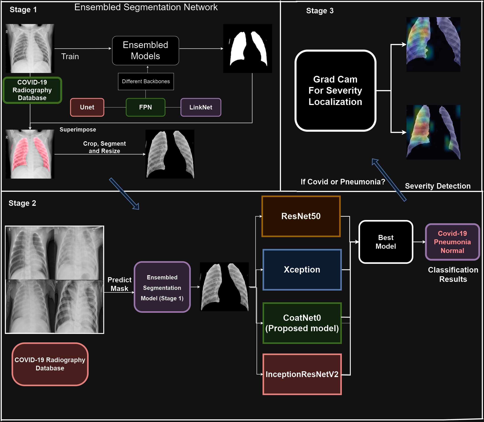
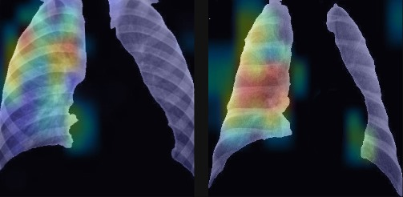

# Project Name: A Hybrid Multi-stage Network for Lung Segmentation, Disease Classification and Severity Localization from X-ray Images

## GitHub Folder Structure

- `segmentation-notebook.ipynb` - Contains the code and implementation of lung image segmentation.
- `classification-and-localisation-notebook.ipynb` - Contains the code and implementation of lung disease classification and localalisation.

## How to run the notebook

### Prerequisites
Before starting, ensure you have a Kaggle account or access to Google Colab, and Python 3 installed if running locally.

- **Step 1: Download the Dataset**
  - Download the [COVID-19 Radiography Database](https://www.kaggle.com/datasets/tawsifurrahman/covid19-radiography-database).
  - The dataset should include images and masks for COVID-19, Lung Opacity, Normal, and Viral Pneumonia.

- **Step 2: Setup Your Environment**
  - **Kaggle**: Upload the dataset to your Kaggle account and use it in a new notebook.
  - **Google Colab**: Upload the dataset to Google Drive, mount the drive in Colab, and update paths accordingly:
  
- **Step 3: Update the paths to the dataset in your notebook based on your environment setup.**
- **Step 4: Run all the cells**

## DATASET

For our project, we are using the [COVID-19 Radiography Database](https://www.kaggle.com/datasets/tawsifurrahman/covid19-radiography-database). This comprehensive database contains chest X-ray images for three distinct classes: COVID-19, normal, and viral pneumonia. Specifically, the dataset comprises 3616 images of COVID-19 positive cases, 10,192 images categorized as normal, and 1345 images identified as viral pneumonia. This extensive collection allows us to train our diagnostic models effectively, ensuring robust performance in identifying and classifying these conditions.

## ABOUT
Accurate and rapid diagnosis of respiratory diseases such as COVID-19 and viral pneumonia using chest X-rays (CXRs) is crucial for timely treatment and containment efforts. However, traditional diagnostic approaches often struggle with high variability in image quality and the subtlety of disease manifestations, leading to a significant rate of diagnostic errors. To address these challenges, this report presents a novel hybrid multi-stage network that initially segments the lung region in the CXR images, followed by classification and subsequent localization of the disease using Grad-CAM. This approach allows for focused analysis on relevant lung areas, enhancing the model's accuracy and reliability in diagnosing respiratory conditions

## METHODOLOGY
Our approach involves a systematic progression through three stages: segmentation, classification, and localization. This structured workflow allows us to precisely isolate and analyze lung regions, identify pathological conditions, and visually highlight critical areas influencing diagnostic outcomes, thereby facilitating a comprehensive examination of CXR images.

  

## RESULTS

### Segmentation Models Experiment Results

### UNet
| Backbone         | binary_accuracy | dice_coef | iou_score |
|------------------|-----------------|-----------|-----------|
| Mobilenetv2      | 0.7585          | 0.5252    | 0.7511    |
| seresnext50      | 0.9886          | 0.9757    | 0.9941    |
| **inceptionresnetv2** | 0.9906   | 0.9794    | 0.995     |
| efficientnetb2   | 0.9894          | 0.9769    | 0.9945    |
| vgg16            | 0.9282          | 0.7714    | 0.9403    |

#### LinkNet

| Backbone         | binary_accuracy | dice_coef | iou_score |
|------------------|-----------------|-----------|-----------|
| Mobilenetv2      | 0.6167          | 0.4094    | 0.7271    |
| seresnext50      | 0.9967          | 0.9925    | 0.9981    |
| inceptionresnetv2 | 0.998         | 0.9946    | 0.9985    |
| efficientnetb2   | 0.9905          | 0.9794    | 0.995     |
| vgg16            | 0.989           | 0.969     | 0.9907    |

#### FPN

| Backbone         | binary_accuracy | dice_coef | iou_score |
|------------------|-----------------|-----------|-----------|
| Mobilenetv2      | 0.6587          | 0.4794    | 0.7374    |
| **seresnext50**  | 0.998           | 0.9946    | 0.9985    |
| inceptionresnetv2 | 0.9913         | 0.9818    | 0.9955    |
| efficientnetb2   | 0.9920          | 0.9826    | 0.9957    |
| vgg16            | 0.9911          | 0.972     | 0.9917    |

### Classification Models Experiment Results and graphs:

| Model             | Val Loss | Val Acc. | Test Loss | Test Acc. |
|-------------------|----------|----------|-----------|-----------|
| **CoAtNet0**      | **0.159** | **95.8%** | **0.144** | **95.49%** |
| Xception          | 0.182     | 95.63%   | 0.220     | 93.80%    |
| ResNet50          | 0.182     | 93.11%   | 0.220     | 92.64%    |
| InceptionResNet50 | 0.193     | 94.81%   | 0.197     | 93.87%    |

### Grad-CAM Visualizations

  

